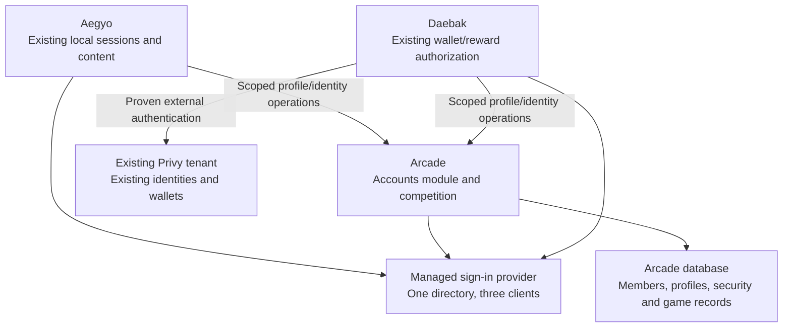

# Technical specification: Aegyo accounts, arcade competition, and community chat

Version: 1.4 — September 11 execution authorized; local proofs started; budget, G1 and rollout gates pending  
Date: September 11, 2026  
Product owners: Mateo, Simon, Fernando  
Engineering: Mateo with Codex  
Target: shared auth, then the Arcade championship live before September 21, 2026; chat follows separately  
Implementation status: planning only; no accounts, deployments, databases, domains, or application code changed.

> Start with the [phased delivery plan](/Users/mateodazab/Documents/myosin/aegyo-arcade/docs/AUTH_AND_LEADERBOARD_DELIVERY_PLAN.md) for the latest scope, access findings, current-user journeys, checkpoints, and audit decisions. It supersedes the former September 23 target and event-only chat assumption. This document retains the detailed technical contracts and failure cases. Mateo audits the plan before implementation begins.

> **External audit:** the [audit record](/Users/mateodazab/Documents/myosin/aegyo-arcade/docs/AUTH_AND_LEADERBOARD_AUDIT_RESPONSE.md) approves bounded proofs under the lean structure now reflected here. “Accounts” means the logical account/profile module hosted inside Arcade. The former standalone app in Daebak is superseded for September. Mateo has authorized execution. Initial isolated proof code and read-only inventories are recorded in the [execution record](/Users/mateodazab/Documents/myosin/aegyo-arcade-auth-proofs/docs/AUTH_PROOF_PROGRESS.md); spend and production rollout remain separate gates.

> **Execution update:** see the [first proof and inventory record](/Users/mateodazab/Documents/myosin/aegyo-arcade-auth-proofs/docs/AUTH_PROOF_PROGRESS.md). Privy has existing identities; custom authentication is off and its production entitlement remains unconfirmed. Auth0 configuration and Aegyo database/restore access are still missing. The same-second retry proof keeps a strict cutoff and waits until the next second before its single fresh-login attempt.

## 1. Decision and priority order

Provide one shared member account, sign-in experience, and username across Aegyo Arena, Arcade, and Daebak. The team call confirms all-three shared auth. Implement and validate it first, then add a monthly competition for two verified arcade games before September 21. Standalone 24/7 community chat is a subsequent phase, with placement and operating coverage still to be confirmed.

**September home: implement the Accounts module in the existing Arcade app/database. No new repo, standalone Accounts deployment, database service, or account hostname is needed for the proof.** Mateo owns it; Simon supports the main site's compatible login/recovery adapter. Profile and competition deployments intentionally share Arcade's runtime, while managed authentication remains at the provider.

Keep existing product URLs, source IDs, content, and wallets. Initial account/profile screens use Arcade's current origin. `account.aegyoarena.com` and a separate service may be evaluated later; they are not launch dependencies.

**The latest preservation requirements supersede the earlier suggestion to move Daebak to an Aegyo subdomain merely to share a cookie.** That remains a possible later branding decision. The first migration should avoid simultaneously changing authentication, browser origin/storage, public URLs, and wallet access.

Priority order: preserve acknowledged data and ownership; preserve existing user capabilities; establish shared auth; enforce account and prize integrity; deliver the championship before the campaign. The deadline is not permission to skip migration checks. No document can guarantee future user happiness or eliminate every operational failure. This spec translates those requirements into measurable release gates, recovery procedures, and explicit stop conditions.

This document supersedes the architecture and delivery assumptions in `TUESDAY_TEAM_PROPOSAL.md` and `ECOSYSTEM_INTEGRATION_PLAN.md`. Team approval of product/provider choices and the technical gates below precedes implementation/cutover.

## 2. Scope and requirements

| ID  | Requirement                                                   | Acceptance                                                                                                                                                                                                             |
| --- | ------------------------------------------------------------- | ---------------------------------------------------------------------------------------------------------------------------------------------------------------------------------------------------------------------- |
| R1  | One shared authentication authority across all three products | An activated member signs in once, navigates all three current domains in the same browser, and resolves to the same member ID without another registration or independent login.                                      |
| R2  | Preserve existing data and ownership                          | All pre-migration records remain in their authoritative stores; exact IDs, relationships, permissions, wallet/grant associations, and accessible content reconcile with the preservation manifest.                     |
| R3  | Preserve user flows                                           | Existing bookmarks, main-site credentials/recovery, content interactions, guest games, wallet connection methods and transactions remain usable during rollout. No forced registration wall on browsing or guest play. |
| R4  | One public username; private contact details                  | Unique normalized username, stable member ID, no email/provider-ID/wallet fallback in new public projections. No silent renaming or repointing of legacy profiles.                                                     |
| R5  | Registered-member monthly competition                         | Verified-email enrollment, two explicitly eligible games, server-verified scores, monthly cumulative points, public standings, and audited winner finalization.                                                        |
| R6  | Moderated community chat (later phase)                        | Standalone rooms with shared identity, server-controlled permissions, reports, personal mute/block behavior, moderation dashboard, AI safeguards, and an agreed operating model for the requested 24/7 availability.   |
| R7  | Independent ownership and releases                            | Accounts build/deploy/rollback does not require a markets/indexer/contracts release, nor access to their signing credentials.                                                                                          |
| R8  | Reversible rollout with live traffic                          | Disable migration/features without deleting mappings or rewinding valid user activity; both migrated and unmigrated users retain a working access path.                                                                |

First-release exclusions: community chat, mobile distribution, repository consolidation, product rebranding/domain migration, contracts or wallet custody changes, transfers between arcade points and Daebuks, non-game activity rewards, replacement-game development, all-game prize eligibility, and a new custom admin dashboard. Existing features outside the new scope continue operating. The later chat phase starts with managed text rooms; custom transport, direct messages, uploads, and user-created rooms remain outside its initial scope.

## 3. Review of all three repositories

This is a source-based review of the integration surfaces in all three local checkouts, not an exhaustive application/security audit or verified production inventory. A September 11 follow-up also inspected current main-site upstream commit `eca06cd8cf79bda305e38e3230c534ac841b2897`: auth helpers/routes and Prisma schema remain unchanged from the earlier review; build/configuration, middleware, and event-registration features have changed. The local `kpop-lyrics` checkout is a July fork. Current GitHub access permits writing the `mateodaza/kpop-lyrics` fork and reading `Francisgood/kpop-lyrics`; GitHub deployment records reported that SHA successfully deployed to Railway `kpop-lyrics / production` at September 11, 15:24:54 UTC; a later check confirms it was superseded by `480831930eea14322fe76f101e4c1ca7a628cb32` at 15:55:08 UTC. The subsequent source diff changes polls. Refresh the base at implementation/PR time. The delivery plan records the exact project/environment link. Actual database service, domain routing, dashboard configuration, and release permissions still need verification. See the delivery plan for source/deployment evidence and the fork-PR release path.

Runtime provider settings, account counts, traffic, billing, database contents, and restoration readiness remain unverified. No production data was exported or modified. Existing unrelated working-tree changes are not part of this spec.

| Repository       | Reviewed surfaces                                                                                                                                                            | Findings that constrain implementation                                                                                                                                                                                                                                                                                                |
| ---------------- | ---------------------------------------------------------------------------------------------------------------------------------------------------------------------------- | ------------------------------------------------------------------------------------------------------------------------------------------------------------------------------------------------------------------------------------------------------------------------------------------------------------------------------------- |
| `kpop-lyrics`    | Prisma schema; auth/signup/login/forgot/reset; roles/access; comments/profiles/follows/votes; newsletter/email; runtime SQL; build/config                                    | Email/password accounts use a custom SHA-256 helper. Email verification defaults false. Display names are non-unique and may default to an email fragment. Some profile relationships use slugs. Runtime-created tables/columns are absent from the Prisma model. Builds run migration/seed and ignore configured type/lint failures. |
| `aegyo-arcade`   | Device/session schema and guards; issuance/submission; seasons/ranking; privacy; game configuration and deterministic logic; shell; test inventory                           | Host-only guest identity; one completed cosmetic run per device/local day portal-wide; weekly boards rank run rows. Scores are client supplied with range checks. Transaction/idempotency patterns and seeded game logic are reusable. Prize evidence must be separate from cosmetic history and device deletion.                     |
| `daebak-markets` | Workspace/build configuration; Privy provider/server verification; wallet lanes and smart-account binding; grants schema/routes; SDK account-link capability; framing/config | Users and rewards depend on existing Privy IDs. Grant/referral records contain immutable wallet snapshots. Privy, Coinbase Smart Wallet, and injected-wallet paths coexist. The SDK exposes external-JWT linking. New auth must not create a second wallet/user or repeat signup grants.                                              |

Preserve main-site runtime objects including `User.role`, `Follow`, `SlangVote`, `CommunityAnnotation`, `CommunityComment`, `PasswordReset`, `EventRegistration`, giveaway entries, polls, tips/restock data, and runtime-added content fields. The authoritative inventory must come from database catalogs plus source review, not only `schema.prisma`. Seeded contributor personas are not real accounts or prize entrants. Event registration and newsletter subscription do not establish an authenticated or verified account; preserve their contact records and consent independently of member activation.

Preserve current main-site role semantics. In particular, existing owner/admin access must not become dependent on a browser-supplied email or on automatic synchronization of a new provider email. Main-site role checks continue to use the verified mapped local user and its existing role/owner configuration; central membership or chat moderation must not grant site administration.

## 4. Repository, deployment, and ownership

The lean proof places Accounts inside `aegyo-arcade`, with account/profile screens under its existing origin and additive member/username/security records in its existing database. Keep the code in a small logical module with narrow interfaces; do not turn Arcade into a monorepo or create `daebak-markets/apps/accounts` for September.

Each app retains its own session store, local user IDs, data, release process, and secrets. The Accounts module receives no market database, minter, paymaster, private-key export, or chain-deployment credentials. Aegyo and Daebak use authenticated, scoped identity/profile contracts where needed. Public profile reads expose no email, wallet, or provider identifiers. A new standalone contracts package is unnecessary; pin the reviewed small contracts in each adapter.

This saves infrastructure work but shares profile availability and rollback with Arcade. Keep ordinary public pages, guest games, already-mapped identities, and supported wallet recovery independent of unnecessary profile calls. New linking and sensitive identity changes require authoritative checks. Prove that an Arcade-only account change does not deploy other products. Review each later Daebak adapter deployment's real build/migration behavior; same hosting-account ownership does not establish safe release isolation. [S7]

Use an isolated staging database and test identities; do not connect preview builds to production. Apply additive, reviewed migrations and test recovery. No production data or credentials are copied into Git/chat. Product-specific DB permissions and release operators remain explicit.

Mateo owns Arcade Accounts, the product adapters, monitoring, and release coordination. Simon can merge/deploy the Aegyo fork PR and assist with inventory and restoration. Simon/Fernando authorize provider spend and name prize/operations owners. No new DNS authorization is needed for the initial account UI.

A later standalone service extraction must preserve member IDs, mappings, usernames, and API compatibility. It is a separate decision once usage/availability requirements justify it.

## 5. Authentication architecture and vendor gate

Use one managed authentication tenant/user directory, with one app registration/client per product; Arcade's client also serves its account UI. **Proof candidate: Auth0 Professional B2C Universal Login, with the existing Privy app accepting linked external authentication for Daebak wallet services.** Current documentation supports this architecture in principle; tenant access, plan features, exact installed-SDK behavior, and identity continuity must be demonstrated before selection is final. [S1–S4]

**Licensing correction from the audit:** Auth0's current pricing puts cross-app SSO and custom database connections under Professional, user import across plans, and back-channel logout under Enterprise. Select an entitled plan or a supported alternative; do not recommend a Free tenant with a license caveat. Bulk import does not eliminate the cross-app SSO entitlement requirement. Configure and test external production email delivery rather than relying on the development mailer. [S12, S14]

Arcade's account UI owns profile/activation entry points and redirects to the supported provider-hosted login. A custom login or account hostname can wait; avoid adding DNS and tenant-domain setup as hidden proof dependencies.

The central session enables top-level redirects between independent domains. Each app maintains a secure local session; there is no shared raw session cookie, query-string bearer token, hidden-iframe dependency, or cross-domain localStorage copy. Use the provider's maintained OIDC SDK and authorization-code/PKCE flow, exact callback allowlists, state/nonce, issuer/audience/expiry verification, and a strictly validated return path. Never forward a client-selected absolute URL unchecked. Profile APIs are not an alternative login protocol. [S1, S5]

Provider identity is `(issuer, subject)`, verified server-side. Demonstrate that all configured clients resolve to the same directory member; do not assume this if pairwise subjects or multiple connections are enabled. Email is never the identity join key. Use provider-supported token types/audiences for Privy, and confirm its JWT validation settings instead of assuming an arbitrary token from the tenant is acceptable. Keep user tokens distinct from service credentials. [S3–S4]

The same-provider-on-one-root-domain Privy shortcut remains an alternative only if the team explicitly accepts a separate domain/credential migration plan. Shared root cookies expand the trust boundary to sibling subdomains, and changing origin can affect stored sessions and passkeys. It is not the default for R2/R3. [S5]

**Phase 1 gate, targeted by September 14:** representative returning main-site and Daebak members must complete shared sign-in across staging origins that reproduce the three-product domain topology, retain owned data/wallets, recover access, and log out correctly. Production-domain behavior is separately verified with authorized staff accounts before launch. Confirm provider plan access, billing, legacy password migration, Privy external-auth enablement, allowed origins, and required grants. If unsupported, surface the deadline conflict and a supported alternative immediately; do not silently replace shared auth with shared usernames or rewrite auth from scratch.

## 6. Data contracts and identity model

Create an independent UUID `member_id` in the Arcade-hosted Accounts module, with immutable mappings to legacy IDs. This replaces the earlier draft's assumption that the main site's `User.id` would own the global directory. Existing local IDs themselves remain unchanged.

| Record                               | Required fields / constraints                                                                                                                                                                       |
| ------------------------------------ | --------------------------------------------------------------------------------------------------------------------------------------------------------------------------------------------------- |
| `members`                            | Immutable UUID, lifecycle status, profile version, created timestamp; no destructive migration cascade into product data                                                                            |
| `auth_identities`                    | Verified issuer, subject, member ID, verification evidence reference; unique `(issuer, subject)`                                                                                                    |
| `app_identities`                     | App identifier, original local user ID, member ID, primary/alias status; unique `(app, local_user_id)`; at most one active primary local identity per member/app                                    |
| `usernames`                          | Member ID, normalized username, display value, change history; unique active normalized username and one active username/member                                                                     |
| `link_intents` / `migration_journal` | Intent ID, target member, authenticated source identity, nonce/proof reference, expiry, step/state, idempotency key, retry/error history                                                            |
| `account_events` / outbox            | Stable event ID, aggregate ID/version, action, minimal payload, delivery/ack status; transactional insertion with local state change                                                                |
| `restrictions`                       | Explicit product/scope/reason/expiry and operator; account compromise is distinct from chat or competition suspension                                                                               |
| `session_security`                   | Member security epoch, reauthentication cutoff, app-session registrations and revocation status; fresh authoritative checks for sensitive mutations; no dependence on browser-cookie deletion alone |

Do not copy passwords, legacy session tokens, financial balances, or game history into the member directory. Provider-controlled authentication credentials are distinct from application profiles. Contact information and verified state have a private projection; public output is only opaque public member ID, username, approved avatar, and explicitly public badges. Return no email, Privy ID, wallet address, device token, or linked-app history by default.

Username draft: 3–24 normalized lowercase ASCII letters/digits/underscores, server validation and database uniqueness, reserved staff/system names, moderation, and a 30-day rename cooldown. Offer suggestions, never derive a public name from email. Username selection is required for new public competition/chat participation, not for reading content, guest play, or accessing an existing wallet. Existing names and `/u/...` links keep their meaning; new usernames do not overwrite historical slug-based follows/annotations.

### Accounts contracts for the lean module

The following defines logical operations and security boundaries, not a requirement to implement unused public endpoints or a separate service. Implement only the auth/profile/link/security operations required by the accepted proof, using existing product routes where appropriate. Defer chat and a generalized events API until their phase.

| Endpoint                                 | Caller and behavior                                                                                                                                                                                                  |
| ---------------------------------------- | -------------------------------------------------------------------------------------------------------------------------------------------------------------------------------------------------------------------- |
| `GET /api/v1/me`                         | Verified member session; returns member ID, profile completion, verified-contact status, scoped restrictions and profile version; private/no-store                                                                   |
| `PATCH /api/v1/me/profile`               | Member session + CSRF protection; optimistic profile version; `409` on username/version conflicts; field allowlist                                                                                                   |
| `POST /api/v1/link-intents`              | Fresh authenticated session; creates short-lived intent bound to the member/session, requested source app, nonce, and safe return path                                                                               |
| `POST /api/v1/link-intents/:id/complete` | Authenticated product adapter provides source proof; consumes nonce once; transactional uniqueness/conflict checks; browser-supplied legacy IDs are never proof                                                      |
| `GET /api/v1/public-members/:publicId`   | Public allowlisted profile only; versioned cache with removal/invalidation support                                                                                                                                   |
| `POST /api/v1/chat-token`                | Authenticated verified member with username; checks room permissions and restrictions; returns short-lived provider access, never an admin key                                                                       |
| `POST /api/v1/events/ack`                | Scoped service credentials; idempotent acknowledgement of an event version; no user impersonation                                                                                                                    |
| `POST /api/v1/session-revocations`       | Fresh authenticated member/session or narrowly scoped security operator; commits revocation and monotonic epoch/cutoff, emits app/provider cleanup events; never a public unauthenticated logout-by-user-ID endpoint |
| `GET /api/v1/session-state`              | Authenticated app adapter for its member/session; returns the current epoch/cutoff/restrictions and revocation state; sensitive authorization reads are uncached                                                     |

The provider SDK owns login/callback/logout routes in each app. Every service token has a specific audience and action scope; reject user tokens at service-only proof endpoints. Link intents expire after five minutes and require a fresh proof for retries after expiry. Return stable non-sensitive error codes such as `link_conflict`, `reauth_required`, `provider_unavailable`, and `profile_incomplete`, with recoverable UI.

## 7. Migration protocol: no data movement by default

### 7.1 Preservation manifest and backups

Before any production change, Mateo and Simon produce a private, access-controlled inventory of all actual tables, columns, indexes, triggers, source IDs, dependent record counts, identity links, profile aliases, role assignments, and relevant provider identities. Use database catalogs as well as ORM schemas. Include object storage/provider-held assets and on-chain wallet/position references; database backups cannot recreate private keys or roll back chain state.

Take verified backups of each affected authoritative store and Accounts configuration. Restore into isolated staging, exercise representative user journeys, and record the restoration timestamp and evidence. For every account in the migration cohort, record stable IDs, per-entity ownership counts, role, wallet/CSA mapping, grant/referral wallet snapshots, and profile aliases. Hash immutable fields with a documented canonicalization; compare changing records at a defined checkpoint and account for later writes explicitly. A simple before/after total-row count on a live database is insufficient.

Require **zero missing baseline source IDs, zero unexplained changed ownership/role/wallet fields, zero new orphans, and zero duplicate identity assignments**. Ordinary legitimate writes after the checkpoint remain valid and must be accounted for in change journals/reconciliation, not erased to make counts match. Do not commit manifests, private exports, emails, or provider keys to this repository.

Backups are recovery aids, not the migration algorithm. No `DROP`, `TRUNCATE`, reseed, mass ID rewrite, full-account recreation, or destructive merge is permitted in this rollout. Existing data stays authoritative in place. New mapping/schema changes are additive and compatible with old application readers.

### 7.2 Main-site adapter and migration with Simon

The audited proof starts with the controlled bulk-import alternative described below, including an explicitly bounded credential-write freeze and closed provider login until reconciliation. If that fails the preservation/UX gate, the first-login path remains an alternative. The following numbered sequence documents the first-login path; its local-session, recovery-authority, new-user, role, and profile-preservation requirements apply to either mode. Do not run both credential authorities concurrently for an activated member.

1. Add a server-side adapter that accepts the shared provider session and resolves the existing local `User.id` through the verified mapping. Retain current legacy login/session support for unmigrated members while the transition is active. Product authorization continues using the mapped local record.
2. Prefer supported first-login credential migration. The provider verifies the existing password through an authenticated, rate-limited legacy adapter and adopts it using its own supported storage. Keep the legacy secret/hash verifier inside Simon's service; do not export the password database/pepper into Accounts. Do not mark existing emails verified merely because password authentication succeeded. [S2]
3. The provider migration hooks must handle both login and user lookup/signup/recovery paths consistently. Mark migration/credential authority explicitly and make retries idempotent. A retired/deleted/revoked local user cannot be re-imported later.
4. For already logged-in members, reuse a valid legacy session to identify their source account, requesting fresh authentication for account linking/security changes when necessary. Reconcile it with the independently authenticated central member; do not elevate an unverified email match into ownership proof.
5. Keep current password login and Mailjet recovery usable until their replacements are proven for that member. After migration, forgot/reset/password-change routes forward to the authoritative provider; invalidate old reset codes and legacy credentials/session grants as appropriate. Prevent two active password authorities from drifting. A previously issued reset code must not change an obsolete password that appears to succeed but cannot log the member in.
6. Preserve local email/roles and content ownership during activation. Any future contact-email change is an explicit verified workflow and must not acquire/revoke main-site owner privileges through automatic email synchronization. Simon's privileged accounts use a separately rehearsed migration path.
7. For genuinely new central members entering the main site, create the necessary local projection exactly once, with minimal required fields and a stable mapping. Explicitly represent externally authenticated users rather than inventing a usable password. Existing code/schema requires a non-null password hash, so design its backward-compatible external-auth marker/nullability migration and fallback denial before shipping. Email conflicts enter recovery/link review, not an upsert that overwrites the old owner.
8. Preserve current profile names/aliases and `authorSlug`/`targetSlug` relationships. Do not bulk replace display names with new usernames. Existing bookmarks remain resolvable; new canonical account-profile URLs can be added separately.

Prefer adapting the verified OIDC callback to issue the existing local `Session` row and `session` cookie, preserving `getSession` consumers and local roles. The callback still requires complete protocol, return-path, and identity-proof validation through a supported library. Add a unique issuer/subject mapping via a reviewed additive migration. Do not choose unreviewed request-time DDL solely because other features use it. Login/signup/recovery authority changes must ship coherently, including rejection of unusable external-password markers by legacy paths.

**Bulk-import alternative, not an automatic replacement for §7.2:** Auth0's schema can represent SHA-256 with a suffix salt and hex hash encoding. Verify the production hashing secret/history and byte encodings on synthetic cases; preserve verification flags and original IDs through explicit mappings. This approach exports credentials to the provider and needs a secured import procedure. Keep the imported connection closed until snapshot deltas, in-flight resets, deletions and the final activation race reconcile. Auth0 permits updating an imported custom hash only before login with that hash; a later re-import cannot be assumed to overwrite a provider password. Prove recovery and rollback after first login/reset. Choose bulk versus supported first-login migration based on the measured preservation proof, not an assumed SSO cost saving. [S13]

The current main-site build command includes schema migration and seeding, and configuration ignores type/lint errors. Never use its ordinary build against a production-connected environment as a read-only check. Simon must approve a controlled additive migration/deploy path, explicit type checks, and a non-destructive seed policy before the adapter release. Test against restored staging only.

Make the credential mode explicit: Auth0 documents both delegation to a custom external store and automatic import/migration; they are different behaviors. This spec's preferred path uses supported migration and a tracked authoritative source per member. Do not accidentally configure continued legacy-password delegation after declaring a provider password reset authoritative. If the team chooses delegation to preserve the legacy credential store initially, revise signup/reset/availability responsibilities as one coherent alternative before implementation. [S2, S11]

### 7.3 Daebak wallet-preserving migration

Keep the current production Privy app/tenant and existing Privy IDs. A source identity is `(privy_app_id, privy_user_id)`; a wallet string or email alone is insufficient.

Before an existing member is authenticated through a new external JWT, authenticate their current Privy identity and link the central subject using the supported `useLinkJwtAccount().linkWithCustomJwt` path. The installed 3.23.1 SDK exposes this operation. Verify the resulting linked accounts and original Privy ID server-side. **Do not first auto-login the external identity and provision a new Privy user/wallet.** [S3–S4]

Use a migration state machine: `discovered → proof_verified → provider_link_pending → provider_link_confirmed → mapping_committed → continuity_verified → active`. Vendor linking and local database writes are not a distributed transaction. Persist the intent first; on retry, inspect current provider state before performing another link. A timeout after provider success must resume from the confirmed association, not create a replacement identity. Conflicts require verified recovery; never overwrite another member's link.

Disable automatic external-auth synchronization/wallet creation for members in an unresolved migration state. Keep existing provider login methods available for recovery during the transition. For new members, create a wallet only when they first use Daebak and the identity mapping is settled. Visiting the main site, Arcade, or chat must not create wallets or trigger grants.

Privy warns that enabling client-side JWT authentication allows a valid token holder to call Privy without additional checks placed only in our backend. Browser coordination alone therefore cannot enforce a migration lock or prevent a duplicate provider identity. Keep provisioning on a supported controlled path until ownership is resolved; otherwise require the provider to enforce the association/creation restriction and verify it with a direct-call test. If neither is supported, the migration gate fails. Server-side grant authorization still verifies the existing member/Privy/CSA association and never rewards a new accidental DID. Do not claim the UI lock is a security boundary. [S3]

Retain supported independent wallet-recovery methods and test access if the central provider is unavailable or an account is suspended. Do not delete a Privy identity merely because its central directory record is deleted, and do not export/import private keys as a migration technique. For new wallets, confirm the recovery design before granting value; no assumption that a database backup recovers wallet credentials. [S4]

Continue using Daebak's existing verified Privy identity, embedded EOA-to-CSA derivation, connection-lane selection, and transaction authorization. Accounts is not a trading authorizer. Do not replace grant keys, referral attribution, immutable grant wallet snapshots, amounts, mint retry markers, or indexer cursors. Migration itself performs no mint, transfer, claim, or wallet rotation. Preserve existing ongoing operations and reconcile their legitimate progress.

Include Coinbase Smart Wallet and injected-wallet members in the plan. They retain their existing connect/transaction UX and gas behavior; no forced embedded-wallet replacement or asset movement. Establish optional shared-profile association with a fresh supported ownership signature or provider proof. Shared member authentication and a wallet's transaction authorization are distinct. Existing wallet-only users retain access while they activate a profile; activation is required for new email-registered competitions, not retroactively for existing wallet access.

### 7.4 Arcade guests and historical activity

Keep `__Host-aegyo_device`, local/device state, historical runs, generated handles, and streak semantics intact for current play. Add a distinct authenticated session and a new account-owned competition namespace. Do not convert device IDs into members or assign all device history to whoever next logs in.

Competition ownership is fixed at challenge issuance from the verified member session. Signing out or switching members cannot reassign a run or reset account-based quotas. Keep in-progress guest games running during sign-in prompts; offer a new official run after activation rather than relabeling an old guest result. Historical cosmetic data remains accessible through its existing device context; it does not become prize evidence.

Do not navigate to the login provider during an active game. The default account CTA appears after the game ends; an explicit pause-and-auth flow is allowed only if that game has a tested state-restoration contract. A top-level redirect normally destroys the running page, so an untested promise to resume it is not acceptable. Before an official run, refresh/check the local session for the planned run duration; failed refresh leaves practice available.

Device-data deletion must not cascade into member identity, other members on that device, or competition records subject to the new published retention policy. Distinguish guest reset from authenticated account deletion in UI and API. Legitimate deletion/revocation requests must still be respected; “no data loss” means no accidental migration loss, not overriding a user's deletion choice.

### 7.5 Duplicates, overlap, and new writes

Matching normalized emails generates a private review candidate only. Require proof of both existing identities before consolidation, including Apple relay/social-email differences. Do not strip email dots/plus suffixes as a universal identity rule. Preserve duplicate source accounts until a reviewed resolution; never silently union roles, content ownership, wallets, or balances.

For a verified consolidation, choose a surviving member ID, retain immutable aliases/migration history, and preserve original product identities. Use one active primary mapping per app; unresolved same-app duplicate ownership remains a conflict, not an automatic merge. Cross-system steps use idempotency keys and a resumable journal.

Deploy adapters before backfill/cutover so new signups and mutations can be mapped consistently. Each app writes authoritative product data locally and enqueues a minimal identity event in the same transaction when needed. Use an outbox with retries and versioned, idempotent consumers rather than best-effort simultaneous writes to two databases. New central-member/local-projection creation must recover from crashes and unique-email conflicts without creating orphan users or hijacking an existing account.

## 8. UX and operational continuity

Keep current domains, deep links, query parameters, referral attribution, locale, and safe intended destination after login. No new global sign-in wall; browsing, music/content discovery, guest arcade play, and existing market access retain their present entry points. Prompt for username/email verification at the point of new public participation. Use existing EN/ES localization, mobile layouts, and accessible controls; avoid importing the wallet runtime into the main site or Arcade.

A successful shared login means one active central session in the same browser can authenticate all three apps through top-level redirects. Separate browsers, expired sessions, and security step-up may require login again. Do not promise invisible cross-browser session sharing. Provide a recoverable flow in social in-app browsers when provider login requires opening the system browser; preserve the destination without copying reusable credentials.

Global logout requires revoking the central session and local sessions, cleaning relevant client caches, and clearing Daebak's Privy/wagmi state. Logging out of one app alone must not be described as “sign out everywhere.” New protected writes validate member/session revocation; design the local-session revocation event plus a short cache lifetime and a sensitive-action check. Identity changes invalidate query caches to prevent showing a previous user's private content on shared devices.

Auth0's documented OIDC back-channel logout requires an Enterprise subscription and its delivery is asynchronous. Do not assume that feature is available or instantly revokes app sessions. The baseline uses an Accounts-owned security epoch/reauthentication cutoff and app-session registration: commit revocation, call the supported provider logout/revocation operation, and propagate local-session/cache cleanup. Every new sensitive application mutation checks the authoritative epoch/restrictions, with no stale-cache acceptance. If that check is unavailable, the mutation does not proceed. Ordinary private-session refresh/UI checks may cache for at most 30 seconds and recheck on focus; public content is independent. [S8]

A still-active provider session or refreshed token must not automatically resurrect a revoked app session. At callback/reauthentication, validate a provider-supported authentication time against the cutoff, and force fresh interactive authentication when needed; a new token `iat` is not evidence of fresh user authentication. If the chosen provider/SDK cannot enforce this with supported claims/flows, choose a supported session-revocation mechanism or change provider before release. Add provider back-channel events where available, but do not rely on them alone. For Daebak, cleanup means app and Privy/wagmi session state; it cannot cancel a previously signed/on-chain transaction or revoke the user's independent external-wallet keys.

An implementation may reduce the session registry/event machinery if existing local stores plus a small shared record pass the same tests. It must not copy a new epoch onto a session renewed silently from pre-revocation SSO authentication. Retain the cutoff or an equivalent proven provider-side freshness mechanism. Short absolute sessions and `prompt=none` renewals do not themselves solve this bypass, and renewal redirects must not destroy an active game.

Auth0's post-change-password trigger is asynchronous and its outcome does not affect the password transaction. A single Action HTTP call to update the epoch is not a demonstrated delivery guarantee. Verify supported durable detection/reconciliation and the allowed propagation bound for delayed, failed, duplicate, and out-of-order notifications, including reset events during a directory outage. Test actual selected-tier session/token revocation capabilities. Preserve fail-closed sensitive authorization when current security state cannot be established; a missing notification must not be mistaken for authoritative evidence that no reset occurred. [S16]

The audited synchronous fallback uses a post-login Action to include the current `event.user.last_password_reset` state in a protected custom claim for database connections. Auth0 documents this property as absent at user creation and documents post-login as synchronous, including refresh-token exchanges. Prove each client's actual top-level silent authorization flow executes the Action and returns the required claim; do not infer that from the refresh-token protocol list alone. [S17–S18]

Every authorization request sends an explicit `max_age`, including top-level `prompt=none` renewals. Use a finite policy value for routine authorization, fixed at G1, and `max_age=0` for required fresh authentication; setting zero on every ordinary visit would defeat the intended SSO experience. Each adapter validates the signed ID token and its required `auth_time` against the server-recorded authorization request. This validation remains required even if an Action enforces the reset cutoff. A newly issued token's `iat` is not original authentication time. [S15]

The invariant is to reject authentication with `auth_time` earlier than the current password-reset cutoff, regardless of whether a local session exists. Prefer enforcement in the synchronous post-login Action for all three clients, using a proven equivalent authentication timestamp. G1 must establish that `event.authentication.methods` exposes the relevant original authentication timestamp on interactive and silent flows, its precision, and its relationship to the issued `auth_time`; the retrieved event reference describes the methods array but does not establish those per-method details. Do not use the most recent arbitrary method, such as an MFA/custom-method completion, as evidence of fresh primary authentication. If the Action cannot establish trustworthy freshness in a flow, all three adapters must enforce the same reset comparison server-side against the signed reset-state claim before minting any session or downstream Privy authority. This fallback stays mandatory until the centralized path passes the proof. A refresh-token alternative requires its own evidence before enablement. [S17–S18]

Operator-initiated revocation still uses the authoritative shared cutoff/epoch. Comparing only with a previous local session's reset claim does not cover first entry or cleared app cookies. Require an explicit no-reset-yet state; distinguish missing claims, malformed timestamps, and unsupported connections. Test seconds-versus-milliseconds and resets/authentication within the same second: timestamp rounding must not accept authentication that predates the cutoff.

The Action can reject the current transaction with `api.access.deny`; the adapter handles the recognized stale-authentication outcome by discarding the affected local session and starting one new authorization transaction with `max_age=0` and without `prompt=none`. Validate callback state and fresh transaction parameters through the SDK. Prove how the selected SDK conveys that denial; do not turn every generic `access_denied` into a retry. A second denial, a missing trustworthy freshness signal, or an unrelated policy denial ends in a recoverable error without minting authority or looping. The retry must also pass freshness validation. [S19]

A reset timestamp learned at renewal bounds detection by renewal, not by the moment the password changes. At G1 set a numeric absolute session lifetime and measure old-session access with the async Action disabled, including sensitive writes and private views. Reconcile the measured bound with the 30-second visibility target and the sensitive-action policy; an unapproved longer bound cannot be called compliant. Preserve active games when auth renewal is due. The async path remains an accelerator; shared epoch/operator-cutoff checks and proven synchronous freshness are the baseline.

An Accounts/profile outage must not break public content or guest play. Existing local sessions and already-authorized wallet flows continue according to their existing security policy. New identity linking, competition admission/submission, and chat-token issuance fail closed with retry guidance. Separate chat/competition restrictions from wallet recovery/access; a room moderator cannot lock someone out of their assets. Test provider-outage recovery for both legacy and migrated members.

For an already-issued official game, distinguish durable evidence receipt from competition authorization. If the product can validate the unexpired local session and bound challenge but the central status check is temporarily unavailable, it may durably store bounded evidence as quarantined/pending and acknowledge only that state. It must recheck revocation, eligibility, time and the game result before awarding points. This preserves a submitted run during a transient identity outage without accepting it prematurely. If durable storage itself fails, never display “saved”; retain a bounded local retry copy and apply the published outage/expiry policy. New challenge admission remains closed during the outage.

Before rollout, measure current conversion and performance with consent-appropriate aggregate metrics. Monitor login success, migration completion, support contacts, guest-play starts/completions, first competition entry, returning members, and chat incidents. Never put email/provider credentials in analytics. Define launch baselines per product and browser; early low-volume fluctuations do not prove retention effects.

Proposed release tripwires: immediately stop expansion on any wrong-user/wallet result, missing record, privilege drift, or cross-user data leak. Investigate/disable the affected new flow for sustained technical auth errors above 1% (minimum 100 attempts) or a confirmed critical-journey regression. At lower traffic, review each migration failure. Target no added auth/wallet JavaScript on anonymous content/game routes and no more than 10% degradation of existing measured p75 load/start metrics; confirm realistic budgets before implementation. Engagement is an observed outcome, not a guaranteed claim.

## 9. Monthly competition implementation

Keep the existing weekly cosmetic boards. Add a clearly separate monthly championship for authenticated members and two verified games, provisionally Snake and Bias Flap. Verify each game's deterministic simulation clock/input behavior before confirming eligibility; current score bounds alone are insufficient. Claw and exposed-answer daily games are outside the initial prize scope.

Proposed policy for audit following the call: up to three official attempts per member/game/UTC day, unchanged casual practice, and the best verified result per member/game/day converted to 0–1,000 championship points using a published fixed calibration table. Sum those daily contributions for monthly points. This supersedes the older one-attempt proposal. Do not normalize by arbitrary implementation maxima or add raw scores from games with different scales. Per-game monthly high scores show one best verified result/member. Freeze eligibility, the cumulative definition, and calibration before enrollment; new competition games enter in a subsequent round.

Accepted attempts do not each contribute their full points to the monthly total. Maintain one current best contribution per member/game/day with transactional locking or equivalent serialization. Concurrent accepted attempts update it by the correct difference; duplicate submissions have no additional effect. If a result is disqualified, recompute the best remaining eligible result and record an idempotent audited correction, including negative adjustments when necessary. Preserve original evidence and version the moderation decision. The month total must always reconcile to the sum of eligible daily contributions.

New records: seasons/rule versions, enrollment, account/day/game entitlements, challenges, bounded input-trace evidence, verification results, point ledger, aggregate standings, moderation decisions, winner snapshots, and fulfillment status. Separate them from device-based counted-run tables so historical behavior is preserved. Product-local foreign references use immutable member IDs and handle deletion explicitly; no cross-database cascading foreign keys.

Challenge issuance binds member, game/build/verifier/scoring versions, seed, issue/expiry, and round. Reserve quota atomically at issuance; resume the same unexpired challenge after reconnect. Abandonment/expiry consumes that official attempt, with a clear pre-run explanation. Confirmed service failures use a published audited remedy, not an undocumented free retry. One member on two devices receives no extra entitlement.

Replay bounded inputs server-side against pinned game code, recompute the score, and store an immutable acceptance receipt/ledger entry. Reject wrong-member, expired, malformed, oversized, replayed, and score-mismatched submissions. Pin fixed-tick/pause semantics and seed behavior; deterministic score verification does not prove human play. Account abuse/bot detection and finalist re-verification supplement it. Human review and range checks alone do not authorize a prize under the existing Arcade spec.

Use a finite synchronous verifier if measured runtime fits the platform limits with margin; otherwise persist a pending submission and process it using a durable worker/queue. Do not assume a Vercel request keeps working after returning. In either case, evidence must be durably accepted before acknowledging receipt. Exactly-once effects come from unique challenge/run/ledger keys and transactions, not an assumption of exactly-once job delivery.

Freeze the first durably received trace hash for a challenge. A retry with the same hash resumes/returns its receipt; a different trace for that challenge is a conflict, not a second candidate. Pending/quarantined evidence is not an accepted score. Record received time, restriction decisions and verifier result separately so closure can distinguish on-time receipt from later validation.

Round boundary: `[first day 00:00 UTC, next first day 00:00 UTC)`, displayed in local time. A challenge expiry cannot exceed its round end. Use a server timestamp for a fully received, authenticated, durable submission; results received before expiry may finish verification after cutoff. Publish maximum run length and accepted-before/verified-after behavior. New challenges near closing show the reduced available time.

Proposed tiebreak: total points, highest combined points earned in a single UTC day, earliest server receipt timestamp reaching the final total. Publish the treatment of exact remaining ties and prize allocation before launch. Zero points are retained in history without a placing rank. Apply disqualification consistently across per-game, monthly, own-rank, and winner views.

Close a month via an idempotent job: reject late new entries, settle accepted pending verifications, review flags, create a reproducible candidate snapshot, approve eligible recipients under the agreed top-10 award policy, and fulfill each award once. Keep provisional/final states visible. Use versioned correction snapshots for appeals; do not rewrite historical evidence. Winner contact is private and staff-authorized. This is a new competition policy, not reuse of the old giveaway roster or prize terms. September's proposed first round starts at the actual published opening and ends October 1 at 00:00 UTC; it has no retroactive guest results. Prize allocation and the shortened round require approval before enrollment.

## 10. Managed community chat — subsequent phase

Chat follows the auth/leaderboard release and does not gate the September campaign. The call specifies standalone 24/7 rooms; the earlier event-only model is superseded. Confirm placement on the main site, the first room list, moderation ownership/coverage, and operating budget before implementation. Use a managed provider such as Stream and its maintained UI components/admin tools. Confirm plan features, message/user limits, costs, retention, and available regional/language moderation before purchase or rollout. No custom WebSocket backend, uploads, DMs, or user-created rooms in the initial chat scope. [S6]

Start with one or a few text-only rooms and named escalation owners/backup. Design for the requested 24/7 availability with AI screening, a human response policy, provider-outage handling, and emergency read-only controls. Limited opening hours are a separate pilot decision if the team accepts them, not an automatic substitute. Use the shared public member ID/username; do not send contact information, wallet links, or internal roles to the provider. Only the trusted backend assigns moderation roles and issues tokens after verification and restriction checks.

Implement reports, personal mute/block behavior as actually supported by the chosen SDK, moderator deletion/timeouts/bans, spam/link restrictions and slow mode. Document distinctions between local hiding and provider-enforced blocking; do not promise nonexistent behavior. Test multilingual fan vocabulary, false positives, and evasions. Automated filtering assists human review; the named operators own escalation coverage, response expectations, and appeals. Provider/AI outage behavior must be explicit and tested.

On suspension/role change, update provider permissions and terminate/refresh active access as supported; relying solely on refusing a future token is insufficient. Reconnect must preserve bans/read-only state. Keep an audit trail, a visible room-close control, and an agreed message/report retention and appeal procedure. Provider retries/webhooks are signed/verified and idempotent. A chat role grants no main-site or market privileges.

Explicitly issue chat tokens with `iat` and `exp`, initially a 15-minute lifetime, through a server-controlled refresh callback. Stream documents that user tokens may otherwise remain valid indefinitely and supports a per-user `revoke_tokens_issued_before` cutoff. Apply the provider's supported token revocation and permission/disconnect controls on logout/security changes and bans, then verify already-open connections and reconnects. Do not infer that token expiry alone immediately removes an active socket or that a token by itself restricts room membership. Server-configured channel permissions must enforce the approved room scope. [S9]

## 11. Rollout, rollback, and recovery

Use additive schema expansion, supported migration hooks, versioned API contracts, and independently controlled flags: `accounts_adapter`, `shared_login`, `migration_enabled`, `competition_entries`, `competition_public`, `chat_room_open`. Map cohort decisions server-side; flags must not let a user evade restrictions by choosing the old route.

Sequence: isolated restoration and baseline → deploy compatible adapters with old UX → shadow mapping/reconciliation without ownership changes → staff test accounts → small invited cohort across all three apps → daily evidence review → broader activation → competition/chat opening only after their own gates. Every phase must support both migrated and unmigrated members.

Rollback is primarily a forward-safe application/configuration action: stop new migrations/entries, deploy the previously verified compatible adapter/UI, preserve the central provider and committed identity mappings for migrated members, and retry pending journal events. A rollback build must still recognize externally authenticated/new users and route password recovery to the correct authority. Do not revert to a build that assumes every member has a valid legacy password.

Do not restore a pre-migration database over live production to undo a code release. That would erase legitimate later writes and could desynchronize grants/on-chain state. For a confirmed data incident, restore into an isolated database and reconcile the missing records forward with audit/review. Never attempt to rewind blockchain activity or remint grants from restored snapshots.

Before each rollout stage, take a fresh preservation checkpoint and confirm recoverability. Keep encrypted backups outside the affected runtime's failure boundary when available. Verify actual backup frequency, retention, WAL/PITR support, and restore behavior in the purchased Railway setup; do not assume “Postgres on Railway” implies every recovery feature. Define infrastructure RPO/RTO after that verification. The migration invariant is zero lost acknowledged records; backup scheduling alone cannot guarantee zero infrastructure-loss exposure.

Railway's current documentation distinguishes volume snapshots, portable logical dumps, and explicitly enabled PITR. PITR requires a completed post-enable base backup and restores to a sibling service; it does not retroactively protect earlier timestamps. Enabling it changes/redeploys infrastructure, so schedule and verify that operation before migration rather than treating it as a harmless last-minute toggle. Keep a tested logical backup outside the affected project's deletion boundary. Verify grants/roles/configuration separately from table contents. [S10]

Restore/rollback rehearsal must include writes made after the initial snapshot, an interrupted provider-link operation, a password reset during migration, a newly created shared member, an in-flight grant, and a previously accepted competition result. Mateo records the compatible release IDs and procedure; Simon verifies the main-site recovery path.

## 12. Phased execution and September deadline

The [delivery plan](/Users/mateodazab/Documents/myosin/aegyo-arcade/docs/AUTH_AND_LEADERBOARD_DELIVERY_PLAN.md) is the authoritative schedule. Mateo audits it before implementation. Shared auth across all three products must pass its continuity gate before leaderboard feature implementation begins; chat is a subsequent phase.

| Checkpoint                                           | Target                              | Exit evidence                                                                                            |
| ---------------------------------------------------- | ----------------------------------- | -------------------------------------------------------------------------------------------------------- |
| Scope audit, production base, release/access owners  | September 11                        | Reviewed plan; fork PR or direct merge/deploy path; dependencies recorded                                |
| Provider and migration proof, G1                     | September 14                        | Returning members, recovery, preserved wallets/rewards, supported provisioning, restore proof            |
| Accounts foundation and all-three integration, G2/G3 | September 16                        | New/returning/overlap users, guest continuity, source reconciliation, revocation and compatible rollback |
| Verified competition and launch rehearsal, G4/G5     | September 18                        | Balanced points, cross-device quotas, verifier/ledger evidence, published rules and award operations     |
| Contingency with named coverage                      | September 19–20                     | Resolve launch issues; all required auth/competition gates still apply                                   |
| Community chat                                       | After campaign launch/stabilization | Separately accepted 24/7 operating model and chat gates                                                  |

The contest must be live before September 21 for the creator campaign and September 22 event. September 18 is the rollout target; September 20 is the last permitted date, subject to confirmed coverage. This replaces the old September 23 estimate. Missing G1 on September 14 or G3 on September 16 requires immediate scope/date escalation. Dates assume prompt audit, focused engineering availability, accessible provider features, available deploy operators, and feasible score verification; none are permission to relax preservation checks. R6 and chat-only acceptance checks apply to the later chat release. All auth/competition portions remain mandatory now.

## 13. Acceptance and adversarial execution matrix

These are required implementation tests, not tests that have already run. Use restored staging and synthetic identities; avoid production mutations during verification. Reuse Arcade's existing rule/conformance/DB/browser tests and Daebak's identity/grant/wallet tests. Run relevant fork-based integration checks if wallet/grant behavior changes, without changing deployed contracts. Add focused main-site tests because its standard build is not a sufficient correctness check.

| ID  | Scenario                                                                                                                                                                          | Passing result                                                                                                                                                                                                                                                                                           |
| --- | --------------------------------------------------------------------------------------------------------------------------------------------------------------------------------- | -------------------------------------------------------------------------------------------------------------------------------------------------------------------------------------------------------------------------------------------------------------------------------------------------------- |
| T01 | Existing main member migrates, posts/follows/votes, edits profile, resets password                                                                                                | Same local ID, content, follows/slugs and role; one current credential authority; no lost post-migration writes                                                                                                                                                                                          |
| T02 | Main-site privileged account and same-email impostor                                                                                                                              | Privileged role remains with the verified original user; unverified/email-only match gains nothing                                                                                                                                                                                                       |
| T03 | Existing Daebak Privy member activates external login                                                                                                                             | Same Privy ID, EOA/CSA, positions and grant/referral snapshots; no extra signup grant or wallet                                                                                                                                                                                                          |
| T04 | Vendor link succeeds, local write/response fails, retry occurs                                                                                                                    | Journal resumes and verifies the existing link once; no orphan/duplicate account or ownership reassignment                                                                                                                                                                                               |
| T05 | Central login visits main, Arcade, Daebak and account portal                                                                                                                      | Same member in each app; safe return route, locale and referral preserved; no independent repeat login in the same active browser session                                                                                                                                                                |
| T06 | Global logout, session expiry, shared-device account switch                                                                                                                       | New protected actions reject revoked sessions; private caches and wallet connections do not expose the prior user                                                                                                                                                                                        |
| T07 | Guest plays, signs in/out mid-session, deletes device data                                                                                                                        | Current guest behavior/history preserved; no prize backfill, new-user ownership claim, or account/competition cascade                                                                                                                                                                                    |
| T08 | Overlapping emails, Apple relay, conflicting legacy identities                                                                                                                    | Verified ownership flow or recoverable conflict; no automatic merge, role union, or wallet replacement                                                                                                                                                                                                   |
| T09 | Username collision/rename with existing `/u/slug`, follows and community annotations                                                                                              | Unique new namespace; old URLs and relationships retain their prior meaning                                                                                                                                                                                                                              |
| T10 | Same member starts/submits on two devices; retries and expired challenge                                                                                                          | At most the approved daily attempt count across all devices; one receipt per attempt; wrong-member/late/replayed submissions rejected consistently                                                                                                                                                       |
| T11 | Forged plausible score, malicious input trace, seed search, oversized payload                                                                                                     | Server recomputation rejects impossible results; bounded work; documented handling of automation risk                                                                                                                                                                                                    |
| T12 | Submission accepted before cutoff, verifier finishes after cutoff, closure job repeats                                                                                            | Accepted evidence handled according to frozen rules; one final snapshot/fulfillment effect; no lost accepted score                                                                                                                                                                                       |
| T13 | Moderator action during active connection and reconnect                                                                                                                           | Ban/read-only/restriction persists; no client role elevation; reports and escalation work                                                                                                                                                                                                                |
| T14 | Accounts/provider/chat outage and delayed/reordered events                                                                                                                        | Existing safe flows remain usable; new admissions fail closed; locally authenticated issued-run evidence may be durably quarantined without points, then revalidated once; idempotent/versioned recovery                                                                                                 |
| T15 | Rollback after new members/writes/reset/grant activity                                                                                                                            | Migrated and legacy members can log in; no DB rewind; retained writes and immutable wallet/reward keys reconcile                                                                                                                                                                                         |
| T16 | Production preview mismatch, wrong token audience, open redirect, CSRF                                                                                                            | Preview cannot affect production; service/user credentials isolated; redirects and linking reject forged proof                                                                                                                                                                                           |
| T17 | Chrome, mobile Safari, social in-app browsers, keyboard/screen reader, EN/ES                                                                                                      | Existing critical journeys remain usable; recoverable sign-in; no destructive navigation, game interruption or private-data flash                                                                                                                                                                        |
| T18 | Account recovery/deletion versus delayed migration events                                                                                                                         | Revoked/deleted identities cannot be resurrected, relinked or awarded new access; product retention decisions remain explicit                                                                                                                                                                            |
| T19 | Auth0 back-channel logout absent/delayed; old provider session silently returns                                                                                                   | Epoch/cutoff blocks old app authority and requires fresh supported authentication; no reliance on Enterprise-only behavior or refreshed token issue time                                                                                                                                                 |
| T20 | Direct client JWT call to Privy before migration mapping finishes                                                                                                                 | Provider-side/provisioning restriction prevents identity confusion; no duplicate valued user/wallet or grant; UI state alone is not accepted evidence                                                                                                                                                    |
| T21 | Arcade Accounts-only change and later Daebak adapter deployment                                                                                                                   | No unintended cross-product deploy or credential exposure; each affected build/migration is scoped and reviewed; an Accounts-only monorepo project is no longer part of September                                                                                                                        |
| T22 | Non-expiring/default chat token, token revocation and active socket                                                                                                               | Explicit expiry and provider revocation/permissions verified; logout/ban cannot be bypassed by an old connection or reconnect                                                                                                                                                                            |
| T23 | Best-of-three attempts complete concurrently, improve the daily best, or are disqualified                                                                                         | One eligible best contribution per member/game/day; only the correct point difference/correction is recorded; monthly totals reconcile without summing all attempts or rewriting evidence                                                                                                                |
| T24 | Event attendee/newsletter-only contact activates a member account; auth deployment touches current event routes                                                                   | Verification required; registration/contact/consent records preserved; no automatic contest enrollment or role assignment; advertised event time and real registration cutoff agree                                                                                                                      |
| T25 | Password reset, old provider SSO session, silent app renewal, delayed/failed/duplicate/out-of-order Action delivery                                                               | Old authentication cannot acquire the newest epoch without satisfying cutoff/freshness; notification failure and reconciliation preserve the agreed revocation bound; active games are not destroyed by renewal                                                                                          |
| T26 | Zero local users but existing Privy identities, or a small nonzero legacy population                                                                                              | Inventory covers provider-only users and valued test/admin records; zero-user simplification requires evidence; all retained identities preserve access, wallets, rewards, and recovery                                                                                                                  |
| T27 | Async reset Action disabled; reset on device A; device B retains pre-reset provider SSO with old or cleared app cookies; first entry into each product                            | Each product independently forces interactive authentication before minting authority from stale SSO, even without local history; reset B to the stale fixture before each product test; existing-session read/write exposure stays within the accepted numeric bound                                    |
| T28 | Every client's interactive/silent authorization sends max_age; method timestamps and auth_time; missing/no-reset/malformed claims; same-second reset; stale and unrelated denials | Prove Action timestamp equivalence or enforce the server-side comparison in all adapters; validate requested freshness; preserve explicit claim states; one max_age=0 retry without prompt=none succeeds after fresh login or ends safely without a loop; separately prove any refresh-token alternative |

Record actual test outputs, cohort reconciliation manifests, provider configuration evidence, measured latency/error baselines, restoration logs, and accountable approvals. No blanket “no data loss” or “UX unchanged” launch claim without this evidence.

## 14. Release checklist

- [ ] R1–R5/R7–R8 and T01–T12/T14–T21/T23–T28 pass for the auth/competition release; all three app owners approve their affected flows. R6/T13/T22 and chat-specific checks apply when chat is enabled.
- [ ] All source IDs/dependencies reconciled, including non-ORM tables, role columns, slug relationships, provider identities, immutable grant/referral wallets, and new writes.
- [ ] Existing and new users retain working login/recovery in the rollback build; migrated credentials have one authority.
- [ ] No new production domain redirect, credential method removal, contract change, wallet replacement, or destructive data action is bundled into this release.
- [ ] Provider access, ongoing costs, isolation, and recovery capabilities are confirmed; secrets and private manifests are not in the repo or client bundles.
- [ ] Published game/scoring/prize/tie rules, verified eligible games, winner owner, and fulfillment procedure are ready.
- [ ] For the later chat release: room scope, 24/7 operating policy, moderation/backup coverage, AI/provider outage handling, and escalations are assigned and rehearsed.
- [ ] Monitoring and stop controls are working; data/ownership violations have zero tolerance.

## 15. Primary sources and repository evidence

Provider statements were checked during planning and in a fresh research pass after the initial draft on September 7, 2026. Auth0 automatic migration and Privy custom-JWT setup were refreshed September 11; the current main-site upstream integration surfaces were also reinspected. Sources support capabilities and constraints, not a claim that the live account/configuration has been validated. Remaining runtime proofs are listed in §16 and the delivery plan.

- S1: [Auth0 single sign-on](https://auth0.com/docs/authenticate/single-sign-on) — central login and independent local app sessions.
- S2: [Auth0 automatic user migration](https://auth0.com/docs/manage-users/user-migration/configure-automatic-migration-from-your-database) — first-login password migration, hooks, deletion/re-import considerations.
- S3: [Privy external authentication](https://docs.privy.io/authentication/user-authentication/jwt-based-auth/overview) and [setup/access](https://docs.privy.io/authentication/user-authentication/jwt-based-auth/setup).
- S4: [Privy account linking](https://docs.privy.io/user-management/users/linking-accounts) — external JWT account linking; checked against the installed 3.23.1 SDK declaration.
- S5: [Privy cookies](https://docs.privy.io/recipes/react/cookies) and [MDN cookie domain rules](https://developer.mozilla.org/en-US/docs/Web/HTTP/Reference/Headers/Set-Cookie).
- S6: [Stream moderation](https://getstream.io/chat/docs/react/moderation/).
- S7: [Vercel monorepos](https://vercel.com/docs/monorepos) — separate root directories/projects and affected-project deployment configuration.
- S8: [Auth0 back-channel logout](https://auth0.com/docs/authenticate/login/logout/back-channel-logout) — Enterprise restriction, session identifiers, and asynchronous delivery.
- S9: [Stream token authentication](https://getstream.io/docs/platform/authentication/) — explicit token expiry, server token providers, and per-user revocation cutoffs.
- S10: [Railway Postgres backup/restore guide](https://docs.railway.com/guides/postgres-backups-restores) and [PITR](https://docs.railway.com/volumes/point-in-time-recovery) — distinct recovery layers and restore behavior.
- S11: [Auth0 custom database modes](https://auth0.com/docs/authenticate/database-connections/custom-db) — delegation versus credential import.
- S12: [Auth0 pricing](https://auth0.com/pricing) — current plan entitlements, refreshed September 11.
- S13: [Auth0 bulk import schema](https://auth0.com/docs/manage-users/user-migration/bulk-user-import-database-schema-and-examples) — SHA-256/salt encodings, imported identity prefix, and limitations on updating custom password hashes after login.
- S14: [Auth0 email configuration](https://auth0.com/docs/customize/email) — production provider integration versus the built-in development provider.
- S15: [Auth0 reauthentication](https://auth0.com/docs/authenticate/login/max-age-reauthentication) — server validation of freshness; not cross-app local-session revocation.
- S16: [Auth0 post-change-password trigger](https://auth0.com/docs/customize/actions/explore-triggers/post-change-password) — asynchronous notification; Action outcomes do not affect the completed password transaction.
- S17: [Auth0 post-login event object](https://auth0.com/docs/actions/reference/post-login/post-login-event-object) — optional database-connection password-reset timestamp; absent at user creation.
- S18: [Auth0 post-login trigger](https://auth0.com/docs/customize/actions/explore-triggers/post-login) — synchronous trigger, including documented refresh-token exchange behavior; the exact silent-authorization flow remains a G1 proof.
- S19: [Auth0 post-login API](https://auth0.com/docs/actions/reference/post-login/post-login-api-object) — `api.access.deny` stops the current login; denial transport and bounded reauthentication handling require SDK proof.
- Local: [main-site auth](/Users/mateodazab/Documents/myosin/kpop-lyrics/lib/auth.ts), [Prisma schema](/Users/mateodazab/Documents/myosin/kpop-lyrics/prisma/schema.prisma), [runtime roles](/Users/mateodazab/Documents/myosin/kpop-lyrics/lib/access.ts), [community store](/Users/mateodazab/Documents/myosin/kpop-lyrics/lib/community-db.ts), [profile resolution](/Users/mateodazab/Documents/myosin/kpop-lyrics/app/u/[slug]/page.tsx), [password reset](/Users/mateodazab/Documents/myosin/kpop-lyrics/app/api/auth/reset/route.ts), [build script](/Users/mateodazab/Documents/myosin/kpop-lyrics/package.json).
- Local: [Arcade schema](/Users/mateodazab/Documents/myosin/aegyo-arcade/src/db/schema.ts), [identity](/Users/mateodazab/Documents/myosin/aegyo-arcade/src/server/identity.ts), [runs](/Users/mateodazab/Documents/myosin/aegyo-arcade/src/server/runs.ts), [ranking](/Users/mateodazab/Documents/myosin/aegyo-arcade/src/server/leaderboard.ts), [device deletion](/Users/mateodazab/Documents/myosin/aegyo-arcade/src/app/api/privacy/device/route.ts), [current policy](/Users/mateodazab/Documents/myosin/aegyo-arcade/docs/TECH_SPEC.md).
- Local: [Daebak workspace](/Users/mateodazab/Documents/myosin/daebak-markets/pnpm-workspace.yaml), [reward schema](/Users/mateodazab/Documents/myosin/daebak-markets/apps/web/src/lib/db/schema.ts), [Privy verifier](/Users/mateodazab/Documents/myosin/daebak-markets/apps/web/src/lib/privy-server.ts), [provider lifecycle](/Users/mateodazab/Documents/myosin/daebak-markets/apps/web/src/providers/web3-provider.tsx), [wallet lanes](/Users/mateodazab/Documents/myosin/daebak-markets/apps/web/src/hooks/use-wallet-connection.ts), [signup grant route](/Users/mateodazab/Documents/myosin/daebak-markets/apps/web/src/app/api/grants/signup/route.ts).

## 16. Post-draft adversarial review

Completed September 7, 2026 after the initial spec was written. Method: reread the complete design against the three source implementations, research current official Privy/Auth0/Stream/Railway/Vercel documentation, trace adversarial state transitions, and revise the design where its assumptions failed. This was a design/code-inspection review, not executed penetration testing, production migration, or proof of provider configuration.

| Attack / failure hypothesis                                               | Finding and revision                                                                                                                                                                      | Verification still required                                                            |
| ------------------------------------------------------------------------- | ----------------------------------------------------------------------------------------------------------------------------------------------------------------------------------------- | -------------------------------------------------------------------------------------- |
| “Back up the Prisma tables and replace the users.”                        | Rejected: runtime-only tables/role fields and slug relationships would be missed. §3/§7 require catalog inventory, identity mapping and unchanged source rows.                            | Catalog manifest and restoration of all three actual data stores                       |
| “Move Daebak to a new origin to make cookies easy.”                       | Rejected as default: adds origin/session/storage/URL migration to an already sensitive change. §1/§5 preserve current domains.                                                            | Existing-domain SSO/browser proof                                                      |
| “Put accounts routes in the markets app; same repo means one deployment.” | Revised: a sibling app/project/db is the chosen boundary. Vercel may still trigger multiple projects per commit, so §4 adds affected-project checks.                                      | Scoped Arcade/Daebak release rehearsal, T21                                            |
| “Sign into the new JWT account, then connect the old wallet.”             | Rejected: may create a second Privy identity/wallet first. §7.3 links the proven existing identity before activation.                                                                     | Same DID/EOA/CSA/grants on first external login, T03–T04                               |
| “A disabled login button prevents premature wallet creation.”             | Rejected: Privy documents direct client JWT access bypassing backend-only checks. §7.3 adds controlled provisioning/provider enforcement as a release gate.                               | Direct-call challenge, T20; if unsupported, the architecture is blocked                |
| “The same email means the same owner.”                                    | Rejected: unverified accounts, relay addresses, and privileged email-based roles make that unsafe. §6/§7 require fresh source ownership and no email-driven role synchronization.         | Overlap/admin recovery cases, T02/T08                                                  |
| “Provider linking and our DB update either both succeed or both fail.”    | Rejected: no cross-vendor transaction. §7.3 journals every step and inspects provider state after uncertain responses.                                                                    | Timeout/crash retry rehearsal, T04                                                     |
| “Switch login but leave the old reset endpoint.”                          | Rejected: two password authorities could report successful but ineffective resets. §7.2 defines authority, mode and recovery routing.                                                     | Reset-before/during/after-migration and deletion cases, T01/T18                        |
| “All providers revoke all app sessions automatically.”                    | Rejected: Auth0 back-channel logout is documented as Enterprise-only and asynchronous. §8 adds epoch/cutoff enforcement independent of that feature.                                      | Provider claims/SDK proof and old-session replay, T06/T19                              |
| “A newly refreshed token proves the user logged in again.”                | Rejected: token issue time is not authentication time. §8 requires supported fresh-auth proof after revocation.                                                                           | Callback/refresh/auth-time behavior in the selected tenant                             |
| “Chat token expiry and our UI ban are enough.”                            | Rejected: documented default user-token lifetime can be indefinite; active sockets/permissions need separate enforcement. §10 specifies expiry, refresh, revocation and channel controls. | Open-socket and reconnect tests, T13/T22                                               |
| “Auth redirects are harmless during a game.”                              | Rejected: top-level navigation destroys the page. §7.4 defers the CTA until end unless restoration is supported.                                                                          | Guest and official-run continuity, T07/T17                                             |
| “An identity outage means discard the player's completed run.”            | Revised: §8/§9 permit bounded durable quarantine of a locally authenticated issued challenge, with no points until full validation.                                                       | Cutoff, revocation-at-receipt, duplicate/different-trace and outage cases, T10/T12/T14 |
| “Restoring the old database is a safe rollback.”                          | Rejected: it erases later writes and cannot rewind chain state. §11 retains compatibility and reconciles isolated restores forward.                                                       | New-account/reset/write/grant rollback rehearsal, T15                                  |
| “Turn on PITR immediately before migrating; backups cover everything.”    | Rejected: coverage begins after the first enabled base backup; provider keys/assets are outside DB backups. §7/§11 add recovery layers and proof.                                         | Actual enabled coverage, restore evidence, wallet recovery                             |
| “A single member directory means a single shared privilege.”              | Rejected: main-site admin, chat moderator, competition suspension and wallet authority are separate. §3/§6/§8 preserve product-scoped permissions.                                        | Cross-app privilege and asset-access negative tests                                    |
| “A plausible or replayable high score proves a fair prize winner.”        | Rejected: range checks do not prove gameplay and valid traces can be automated. §9 requires replay plus an explicit finalist/abuse process.                                               | Both eligible-game verifier proofs and approved winner process                         |
| “Small account counts and AI assistance guarantee ten days.”              | Not substantiated by source review. The September 11 revision adds explicit September 14/16 checkpoints and a pre-September-21 deadline without relaxing preservation checks.             | Actual access, scope and implementation evidence                                       |

September 11 design-review additions: an editable fork removes upstream write permission as a development prerequisite, but does not prove production deployment access; event registrations are not member identities; best-of-three scoring requires serialized daily-best adjustments and disqualification corrections; 24/7 chat requires a separate operating plan. T23–T24 cover the new scoring/campaign cases. These are source/design findings, not executed runtime tests.

### Remaining decisions and evidence, not silent assumptions

1. All-three shared auth is confirmed by the call, and the auditor approves the lean Arcade-hosted Accounts structure for bounded proofs. Mateo has authorized execution; Simon/Fernando authorize spend, and access/rollout evidence remain explicit. Simon can deploy the main-site fork PR without Mateo needing upstream maintainer access.
2. Confirm the selected managed provider's required plan/features and external-auth access. Auth0 is a candidate, not a purchased or production-validated selection. The existing Privy tenant must pass T03/T20 without identity replacement; otherwise return to the team before migration.
3. Obtain production source inventories, real user counts, backup/restore evidence, SDK/tenant session behavior, and measured UX baselines. Local source review cannot establish these facts.
4. Freeze the selected games, best-of-three daily scoring/calibration, top-10 prize allocation, shortened September round, eligibility/tie policy, and retention/recovery responsibilities before public enrollment. Chat coverage and room policy are separate later-phase decisions.
5. All T01–T28 end-to-end acceptance results remain pending. Initial local component tests and read-only inventory results are recorded separately in the [execution record](/Users/mateodazab/Documents/myosin/aegyo-arcade-auth-proofs/docs/AUTH_PROOF_PROGRESS.md); those do not pass migration, browser or rollback gates.

**Review outcome:** the plan is stronger and suitable for team technical review and a tightly gated implementation spike. It is not an unconditional guarantee of zero incidents, a fully proven deployment, or approval to change production.
